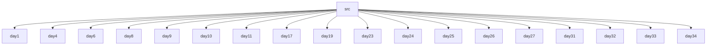

# Web Development Basics
## 🗂️ Description

This repository contains a collection of basic web development projects, covering various aspects of front-end and back-end development. The projects range from simple HTML and CSS exercises to more complex JavaScript and Node.js applications. This repository serves as a learning resource for developers looking to improve their web development skills.

The projects in this repository are organized by day, with each day representing a new project or exercise. The projects cover a wide range of topics, including HTML, CSS, JavaScript, Node.js, and EJS templating.

## ✨ Key Features

* **Front-end development**: HTML, CSS, JavaScript projects
* **Back-end development**: Node.js, Express.js projects
* **Templating engine**: EJS templating engine projects
* **Event-driven programming**: Projects demonstrating event-driven programming concepts
* **Server-side programming**: Projects demonstrating server-side programming concepts

## 🗂️ Folder Structure



## 🛠️ Tech Stack


## ⚙️ Setup Instructions

To run the projects in this repository, follow these steps:

* Clone the repository: `git clone https://github.com/ebhay/WebDev-Basic.git`
* Navigate to the project directory: `cd WebDev-Basic`
* Install dependencies: `npm install`
* Run the project: `node index.js` (or `npm start` for some projects)

Note: Some projects may require additional setup or dependencies. Refer to the project's README file for specific instructions.

## 📈 GitHub Actions

This repository uses GitHub Actions to automate testing and deployment. The workflow file is located in the `.github/workflows` directory.

```yml
name: Node.js CI

on:
  push:
    branches: [ main ]

jobs:
  build:

    runs-on: ubuntu-latest

    steps:
    - uses: actions/checkout@v2
    - name: Setup Node.js ${{ matrix.node-version }}
      uses: actions/setup-node@v2
      with:
        node-version: ${{ matrix.node-version }}
    - run: |
      npm install
      npm test
    matrix:
      node-version: [12.x, 14.x, 16.x]
```

## 📊 Project Structure

The projects in this repository are organized by day, with each day representing a new project or exercise. The projects are further organized into folders, each containing the necessary files for that project.

For example, the `day1` project contains the following files:

* `boilerplate.html`: A basic HTML template
* `table.html`: An HTML table example
* `q2.html`: An HTML list example

Each project has its own README file, which provides more information about the project and its dependencies.


<br><br>

<br>
    
